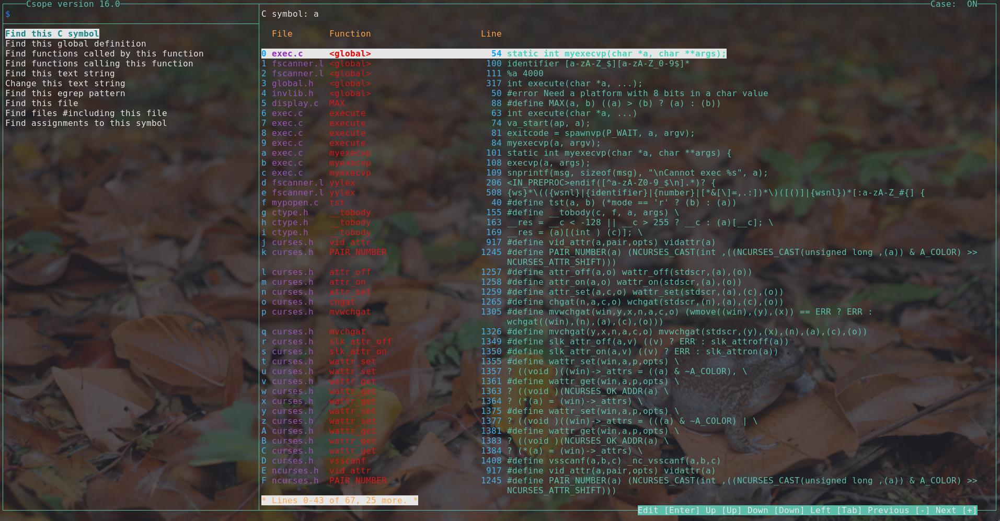
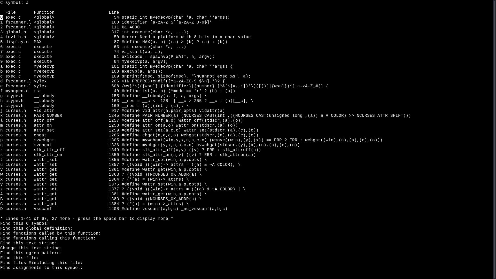

# Csope
Fork of Cscope version 15.9, with various improvements, because cscope is good and shall not be forgotten.
While the original's mainentence seems abandoned and as far as I can tell you need a PhD in autoconf to compile the latest version,
Csope is alive and well.

# Demo
 TODO: fill in

# Before/After
## After

## Before

# Features
#### Search for
 + C symbol
 + global definition
 + assignments to specified symbol
 + functions called by specified function
 + functions calling specified function
 + text string
 + egrep pattern
 + file
 + files #including specified file
#### ...and open with your editor.
#### Batch change search results **interactively**.
#### Save/load/pipe results.

# Interface
	            <-- Tab -->
	  +--Version-----------------Case--+           +--------------------------------+
	A |+--------------+---------------+|           |+------------------------------+|
	| || Input Window | Result window ||           ||                              ||
	| |+--------------+               ||     ?     ||                              ||
	  || Mode  Window |               ||   ---->   ||            Help              ||
	% ||              |               ||   <----   ||                              ||
	  ||              |               ||    ...    ||                              ||
	| ||              |               ||           ||                              ||
	| ||              |               ||           ||                              ||
	V |+--------------+---------------+|           |+------------------------------+|
	  +---------------------Tool Tips--+           +--------------------------------+

# Usacases
Csope shines at exploring stranger and obsecure code bases due to its TUI.
It sometimes gets mislabeled as a code navigation tool, but the original documentation describes it best as a "code browsing tool".
Many tools can jump you to a definition or grep for patterns,
but Csope is unqie in that it allows for those and many other functionalities while providing you with a very comprehansible list of all results,
ready to fire up your editor at just the spot.
An example of its excelence is this project. The Cscope codebase used to be a total mess,
fixing it would have been a lost cause, if not for Cscope itself. Well, Csope now.

# Improvements/Changes
## User side
+ Renamed the program, because "cscope" is annoying to type
+ Improved tui
+ GNU Readline/History integration
## To the code
+ Nuked autoconf, replaced with single Makefile
+ Reorganized the control flow
+ Encapsulated changes to the TUI into display.c
+ Encapsulated searching into find.c
+ Removed "scanner.l" which seems to be an anchient version (and redundant copy) of "fscanner.l" forgotten by all
+ Removed macro hell put in place to allow compiling on a dead badger
+ Use stdbool instead of YES/NO macros
+ Saved kilobytes by stripping trailing whitespace
+ ...and much more

# Installation
You will have to compile from source.
After you made sure you have the following (dev) libraries installed:
	ncurses
	GNU Readline
	GNU History (should come with Readline)
Just run:
	make
This will yield the executable "scope", which you are free to do whatever with.

# Configuration
## Readline
The readline integratoin should be complete -please let us know if not-, except for your prompt being used, which could easily break the TUIs display.

The rl_readline_name variable will be set to "Csope", so you may have conditional configurations in your .inputrc with the following format:
	$if Csope
		# <whatever>
	$endif
## Colors
All can be configured sucklessly under "config/colors.h". Hopefully the comments are self evident.

# Control flow
...

# Project structure	/*probably move to documentation*/
| Component | Purpose |
| :-------: | :-----: |
| main.c | generic init functions, main() and primary event loops (and junk) |
| display.c | all functions directly dealing with NCurses |
| input.c | top layer of functions dealing with user input; migth dispatch to readline |
| find.c | searching functions |
| globals.h | an inherited curse; global var/prototype hell |
| readline.c | all functions directly dealing with GNU Readline; responsible for line editing in *input mode* |
| help.c | all functions dealing with help messages |

# Key Symbols
| Global | Role |
| :----: | :--: |
| int input_mode | Responsible of keeping track how current input should be handled. Not only does  the readline handler depend on it, its also used to determine what types of inputs all legal (e.g. swapping to another window). Takes up on of the values of the INPUT_\* macros.
| int window_change | Bit mask type of the CH_\* macros. Keeps track of the windows to be refresed on the next run of display(). Could be better utalized.

# TODO /*move soon*/
+ sort out the global hell
+ sort out constants.h
+ lineflagafterfile is stupid
+ library.h...; "private library", in a program using 90 globals; ffs
+ scrollbar() uses magic int literals?
+ was there really ever a scrollbar?
+ handle resizing
+ a search struct could be great for caching and could ease the global situation
## Original
+ Same capabilities as interactive in non interactive (one shot) mode
+ Provide some how-do-I-use-this-thing doc.

# BUGS
+ Changing text double frees:
	free(): double free detected in tcache 2
	Aborted
+ Changing text can crash without replacing text and leaving the console ncursed
+ After an attempted change malloc *can* cry and crash
+ Changing text fucks up redisplaying

# Future features / contributor wishlist
+ providing support for other languages by integrating new lexers (e.g. ctag's)
