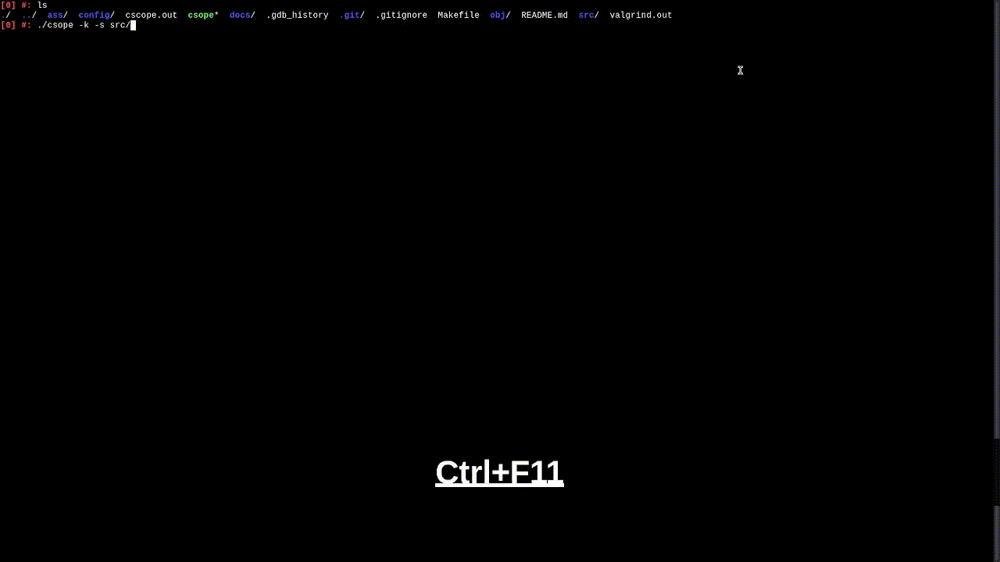
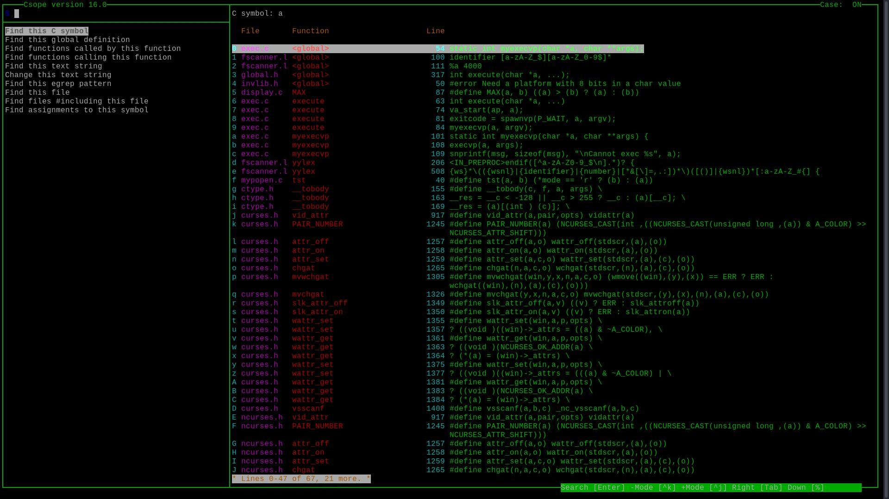
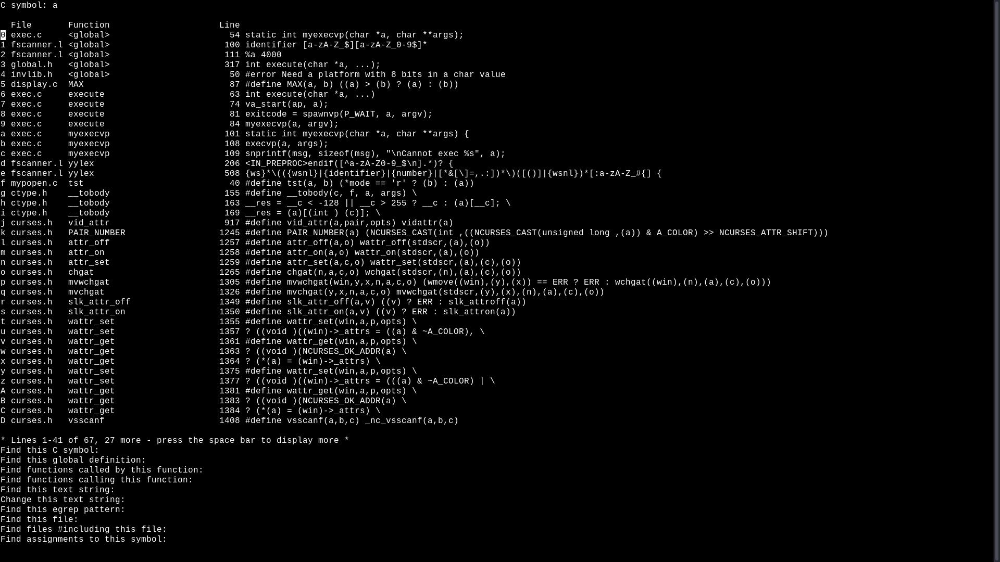

# Csope
> C source code browser.
> Fork of Cscope version 15.9, with various improvements.

Because CScope is good and shall not be forgotten.
While the original's maintenance seems abandoned and
as far as I can tell you need a PhD in autoconf to compile the latest version,
Csope is alive and well.

## Table of contents
- [Demo](#demo)
- [Features](#features)
- [Interface](#interface)
- [Usecases](#usecases)
- [Improvements](#improvements)
- [Installation](#installation)
  - [Gentoo](#gentoo)
  - [From source](#from-source)
- [Quick start](#quick-start)
- [Configuration](#Configuration)

## Demo


### Before/After
#### After

#### Before


## Features

**Search for**
 + symbol
 + global definition
 + assignments to specified symbol
 + functions called by specified function
 + functions calling specified function
 + text string
 + egrep pattern
 + file
 + files #including specified file

**...and open with your editor.**

**Batch change search results _interactively_.**
**Save/load/pipe results.**

#### It fully supports:
 + C
 + Lex
 + Yacc
#### Partially supports:
 + C++
 + Java
 + Specification and Description Language

## Interface
	            <-- Tab -->
	  +--Version-----------------Case--+           +--------------------------------+
	A |+--------------+---------------+|           |+------------------------------+|
	| || Input Window | Result window ||           ||                              ||
	| |+--------------+               ||     ?     ||                              ||
	  || Mode  Window |               ||   ---->   ||            Help              ||
	% ||              |               ||   <----   ||                              ||
	  ||              |               ||    ...    ||                              ||
	| ||              |               ||           ||                              ||
	| ||              |               ||           ||                              ||
	V |+--------------+---------------+|           |+------------------------------+|
	  +---------------------Tool Tips--+           +--------------------------------+

## Usacases
Csope shines at exploring stranger and obscure code bases due to its TUI.
It sometimes gets mislabelled as a code navigation tool,
but the original documentation describes it best as a "code browsing tool".
Many tools can jump you to a definition or grep for patterns,
but Csope is unique in that it allows for those and many other functionalities
while providing you with a very comprehensible list of all results,
ready to fire up your editor at just the spot.
An example of its excellence is this project. The Cscope code-base used to be a total mess,
fixing it would have been a lost cause, if not for Cscope itself.
Well, Csope now.

## Improvements/Changes

## User side
+ Renamed the program, because "cscope" is annoying to type
+ Improved tui
+ GNU Readline/History integration
## To the code
+ Nuked autoconf, replaced with single Makefile
+ Reorganized the control flow
+ Encapsulated various functionalities
+ Removed macro hell used for compiling on a dead badgers
+ Reduced global state hell
+ Use stdbool instead of YES/NO macros
+ Removed dead code
+ ...and much more

## Installation

## Gentoo
Add [my overlay](https://bis64wqhh3louusbd45iyj76kmn4rzw5ysawyan5bkxwyzihj67c5lid.onion/anon/agvxov-overlay.git)
and install using portage.

## From source

After you made sure you have the following installed:
+ ncurses
+ GNU Readline
+ GNU History (should come with Readline)
+ Lex (or GNU Flex)
+ Yacc (or GNU Bison)

Just run:
```sh
make
```

This will yield the executable "csope", which you are free to do whatever with.

Hint:
```sh
cp csope /usr/bin/
```

## Quick start
Start browsing your project by running csope over it's source dir.

```sh
csope -s source/
```

## Configuration

### Readline
The readline integration should be complete -please let us know if not-, except for your prompt being used, which could easily break the TUIs display.

The `rl_readline_name` variable will be set to "Csope", so you may have conditional configurations in your .inputrc with the following format:
```
$if Csope
	# <whatever>
$endif
```

### Colors
All can be configured sucklessly under "config/colors.h". Hopefully the comments are self evident.
