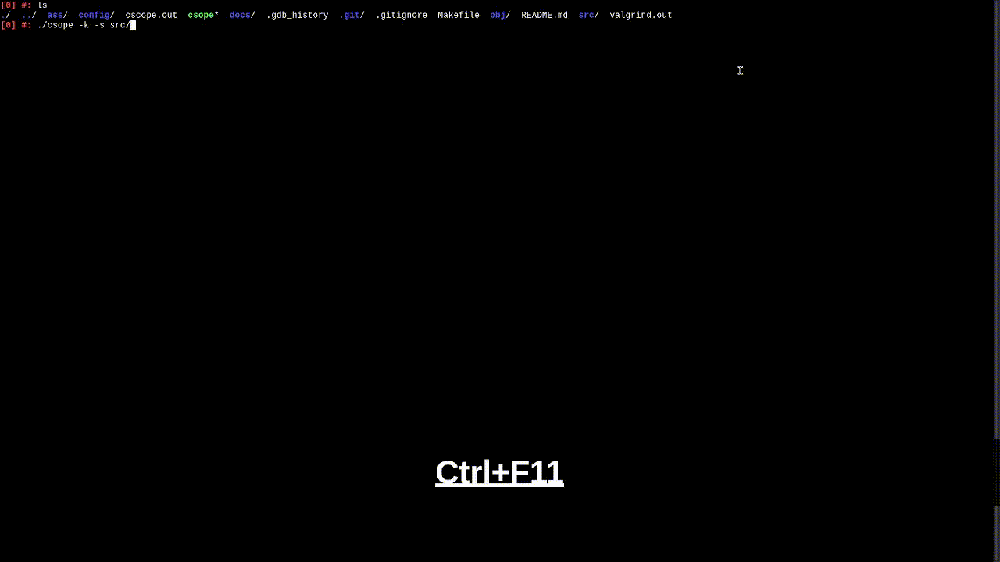
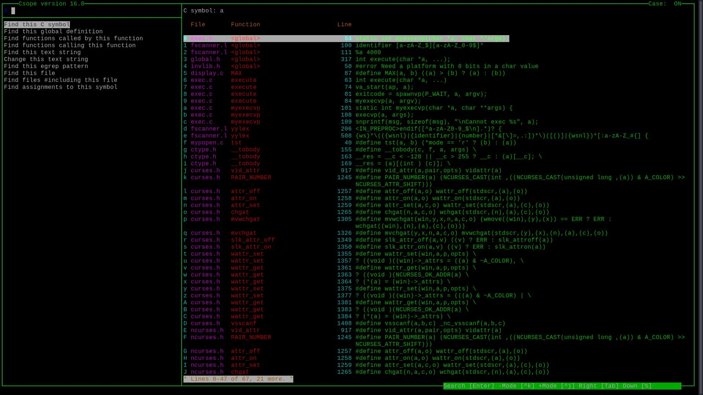
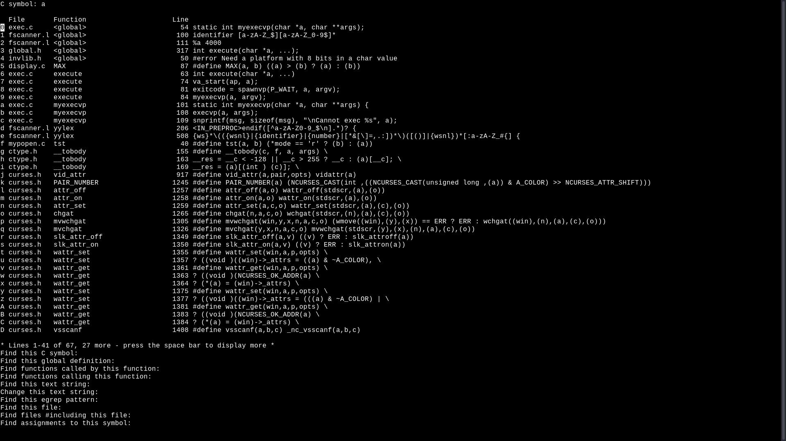

# Csope
> C source code browser.
> Fork of Cscope version 15.9, with various improvements.

Because CScope is good and shall not be forgotten.
While the original's maintenance seems abandoned and
as far as I can tell you need a PhD in autoconf to compile the latest version,
Csope is alive and well.

## Table of contents
- [Demo](#demo)
- [Features](#features)
- [Interface](#interface)
- [Usecases](#usecases)
- [Improvements](#improvements)
- [Installation](#installation)
  - [Gentoo](#gentoo)
  - [From source](#from-source)
- [Quick start](#quick-start)
- [Configuration](#Configuration)

## Demo


### Before/After
#### After

#### Before


## Features

**Search for**
 + symbol
 + global definition
 + assignments to specified symbol
 + functions called by specified function
 + functions calling specified function
 + text string
 + egrep pattern
 + file
 + files #including specified file

**...and open with your editor.**

**Batch change search results _interactively_.**
**Save/load/pipe results.**

#### It fully supports:
 + C
 + Lex
 + Yacc
#### Partially supports:
 + C++
 + Java
 + Specification and Description Language

## Interface
	            <-- Tab -->
	  +--Version-----------------Case--+           +--------------------------------+
	A |+--------------+---------------+|           |+------------------------------+|
	| || Input Window | Result window ||           ||                              ||
	| |+--------------+               ||     ?     ||                              ||
	  || Mode  Window |               ||   ---->   ||            Help              ||
	% ||              |               ||   <----   ||                              ||
	  ||              |               ||    ...    ||                              ||
	| ||              |               ||           ||                              ||
	| ||              |               ||           ||                              ||
	V |+--------------+---------------+|           |+------------------------------+|
	  +---------------------Tool Tips--+           +--------------------------------+

## Usacase
Csope excels at exploring strange and obscure codebases thanks to its TUI.
It is sometimes mislabeled as a *code navigation tool*,
but the original documentation describes it more accurately as a *code browsing tool*.
Many tools can jump to a definition or grep for a pattern,
but Csope stands out because it does all of that and much more while presenting a clear,
comprehensive list of results, ready to launch your editor at the exact location of any entry.
This project itself is a good example of that strength.
The Cscope codebase used to be a complete mess,
and fixing it would likely have been a lost cause without Cscope/Csope.

## Improvements/Changes

## User side
+ Renamed the program, because "cscope" is annoying to type
+ Improved TUI
+ GNU Readline/History integration
## To the code
+ Nuked autoconf, replaced with single Makefile
+ Reorganized the control flow
+ Encapsulated various functionalities
+ Removed macro hell used for compiling on dead badgers
+ Reduced global state hell
+ Use stdbool instead of YES/NO macros
+ Removed dead code
+ ...and much more

## Installation

## Gentoo
Add [my overlay](https://bis64wqhh3louusbd45iyj76kmn4rzw5ysawyan5bkxwyzihj67c5lid.onion/~anon/agvxov-overlay.git)
and install using portage.

## From source

After you made sure you have the following installed:
+ ncurses
+ GNU Readline
+ GNU History (should come with Readline)
+ Lex (or GNU Flex)
+ Yacc (or GNU Bison)

Just run:
```sh
make
```

This will yield the executable "csope", which you are free to do whatever with.

Hint:
```sh
cp csope /usr/bin/
```

## Quick start
Start browsing your project by running csope over it's source dir.

```sh
csope -s source/
```

## Configuration

### Readline
The readline integration should be complete -please let us know if not-,
except for your prompt being used, which could easily break the TUIs display.

The `rl_readline_name` variable will be set to "Csope",
so you may have conditional configurations in your .inputrc with the following format:
```
$if Csope
	# <whatever>
$endif
```

### Colors
All can be configured sucklessly under "config/colors.h". Hopefully the comments are self evident.

## Practical notes
We depend on GNU Readline, which is -as all GNU implementations- a piece of trash.
Sadly no viable alternative candidate has been found so far.

We depend on Ncurses, see above.
Ncurses is outdated, but fragile and rigid and a nightmare when combined with advanced features
such as colors, UTF or concurrency.
No viable alternative were found as all candidates are even more featureless
and have an even more serious problem with flickering
(which to be fair is largely the fault of terminals).

The Cscope parser has a number of positive qualities,
but it is so tightly put-together that it would be easier to rewrite than to change.

Parsing C is a hard problem.
This is partially because of [esoteric grammar decisions](https://en.wikipedia.org/wiki/Lexer_hack),
partially because of esoteric design decisions (sizeof int),
and partially because of the existence of the preprocessor.
Any program that attempts to statically analyze C will be technically janky,
including compilers.

## Future direction
* replace faulty libraries
* make the UI compatible with multiple parser backends and other tools
